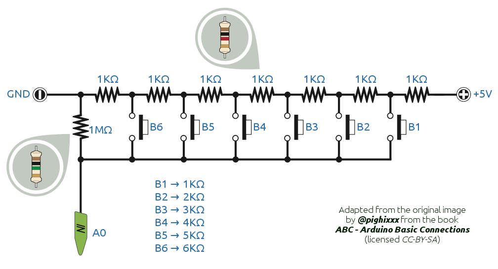

# Botoneira analóxica

A conexión dos botóns de control da Vacalourabot co Arduino é nada máis que por unha entrada analóxica. 

Úsase un esquema de conexións con resistencias que incrementan o seu valor en serie por cada botón, facendo que cada botón produza distintos valores na entrada dixital.

## Montaxe da botoneira

Inclúese o esquema de montaxe da botoneira (en .fzz e .svg) sobre unha placa de tiras (stripboard) de 94x53 mm, que é unha opción doada para a súa implementación. No arquivo stripboardCortesXirado.svg pódense ver os cortes que lle habería que facer á placa. OLLO: este esquema está según miramos a placa pola cara das pistas.

###Lista de materiais:
1. Placa de tiras de 94x53 mm.
2. 7 resistencias de 1KΩ. (1/4 de wattio é suficiente)
2. 1 resistencias de 100KΩ. (1/4 de wattio é suficiente)
3. 6 pulsadores de 6x6 mm. , SPST-NO (pulsadores de catro patillas normalmente abertos)
4. Hilo ríxido de 0.28 mm2.
5. Terminais de conexión (pines, headers...)

## Configuración da botoneira

-ToDo-

